# **RWBY Fan-Made Quiz**

## # Table of contents

1. [Link To Live Site](#linktolivesite)
2. [Wireframes](#wireframes)
3. [Overview](#overview)
4. [User Stories](#userstories)
5. [Features](#features)
    1. [Style Choices](#stylechoices)
    2. [Favicon](#favicon)
    3. [Index Page](#indexpage)
    4. [About Modal](#aboutmodal)
    5. [Game Page](#gamepage)
    6. [Rules, Success and Game Over Modal](#modal)
6. [Implementation](#implementation)
7. [Testing](#testing)
    1. [HTML](#html)
    2. [CSS](#css)
    3. [JS](#js)
8. [Unfixed Bugs](#unfixedbugs)
9. [Deployment](#deployment)
    1. [Local Deployment](#localdeployment)
        1. [Forking Repositories](#forkingrepositories)
        2. [Cloning Repositories](#cloningrepositories)
    2. [Remote Deployment](#remotedeployment)
10. [Credits](#credits)

## **Link to live site**

https://lukemunsch.github.io/rwbyQuiz/

## **Wireframes**

[Index Page Here](/workspace/rwbyQuiz/assets/images/wireframes/rwbyQuizIndex.png)

[Game Page Here](/workspace/rwbyQuiz/assets/images/wireframes/rwbyQuizGame.png)

## Overview

The RWBY Fan-Made Quiz is designed for people to have fun testing their knowledge of the Remnant 
universe and the characters that they have fallen in love with or hate completely.

The quiz is intended to give the user a brief (and occasionally funny) answer set to questions 
about events/people/places they have met/visited within the story told about Ruby Rose and 
her collection of Huntsmen. They can run the quiz multiple times to see how they 
fare against a randomly assigned set of questions.

## User Stories

On the user's first visit to my Quiz site, this will allow the user to test the site and 
try out their knowledge. They can appreciate the aesthetic of the page and how they link 
to the main themes and colors of the RWBY show.

On the second and all further visits to the RWBY Fan-Made Quiz, they will test their knowledge 
further with a series of randomly assigned questions that will differ every time they are 
running the quiz: the number of questions to answer is 20 and the lifelines add extra points 
depending on how many lives are remaining. The randomly selected questions will be chosen from 
the over 60 available, so they may be able to run the quiz 3 times with only occasional repeats.

## Features

Languages used for the RWBY Fan-Made Quiz are HTML, CSS AND JavaScript.

### Style Choices

Using some of the main logo images and personal experience from viewing the show myself;
- I have styled the quiz pages and elements using the themes of the main RWBY team with 
the prominent theme being Ruby Rose (the main protagonist for the show and leader of 
team RWBY) in black and red buttons and highlights. 
- The answer buttons are shown in the 4 main character colors: Ruby - red, Weiss - white, 
Blake - black (dark elements), and Yang - yellow. 
- The text color is supposed to represent the blade color for Crescent Rose (the large 
scythe weapon).

### Favicon

As the most iconic weapon in the RWBY universe, I have chosen Crescent Rose as the favicon.ico to
represent the site in the browser tab. This is the main protagonist's weapons and will also feature 
in the site as the lifeline counter

### Index page

This is the Entry page for the RWBY Quiz - the first page that allows users to enter 
the actual quiz.
- Headed by the main logo for RWBY and a smaller design when the screen responds 
to the smaller widths.
- The main protagonist's icon of Red Rose (for Ruby Rose), used to enter the quiz 
along with the text below just in case the icon fails to load.
- The footer, which is fixed to the bottom of the page, has two pieces of text (or one 
if the screen size is too small) with simple text.

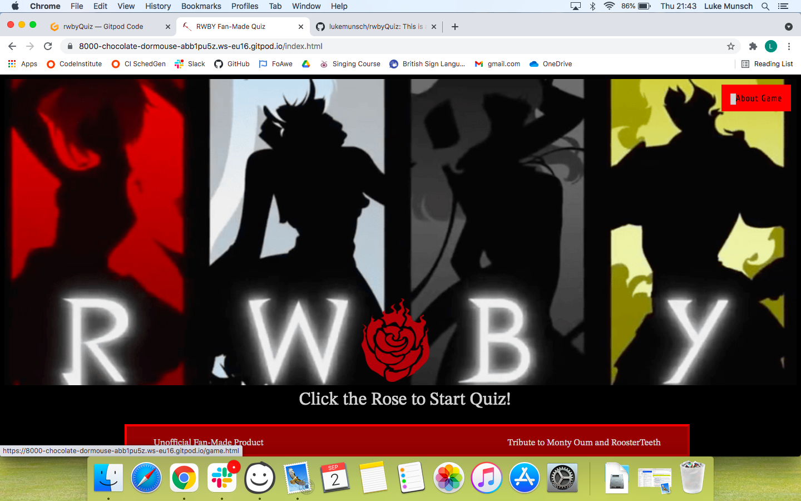

### About Modal

The initial modal pop-up that I created is for the 'about' section which gives the 
users a brief explanation of what the site is about. It is simply filled with 
text elements and a button to make the pop-up close once you are done reading it. 
I considered changing the code for the site completely at the start but the pop-up 
approach made it seem tidier and doesn't affect the rest of the page, only showing 
and hiding the relevant content.

The style of the pop-up is in a similar style scheme to the rest of the site and 
elements with reds and light gray writing with the button in black with same color 
writing as the body.

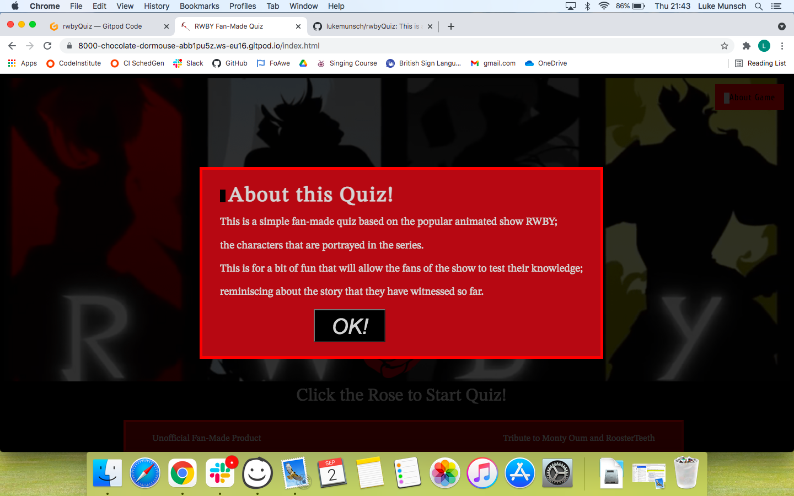

### Game Page

The game page is the main page that contains the quiz itself. Elements for the nav 
and modal buttons similar to the first page with red background color, black writing 
and silver border block on the left.

There is a question section with similar styling to the footer element on the index page
with its red border, dark red background and lightgray writing.

The 4 buttons are all black background with light gray writing. The edges of the buttons are
in the colors of the iconic team colors; red for Ruby, white for Weiss, black (dark gray 
to stand out from the background) for Blake and yellow for Yang. I have not included a 
footer for this page as I didn't feel the need for it.

I also use the iconic weapon Crescent Rose (Ruby Rose's scythe - it's also a gun!) as a lifeline counter
as a small tribute to the main character as well. This is also in a similar color scheme 
to the rest of the site; each one disappearing when an incorrect answer is selected.

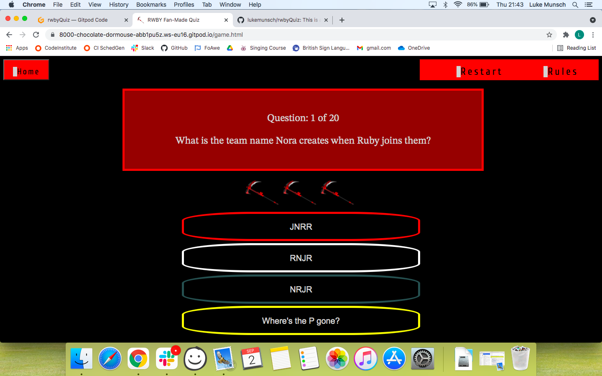

### Rules, Success and Game Over Modal

I have borrowed the same style for the About modal to style the other pop-ups screens that appear;
the Rules with only simple text, the Success and Game Over screens with small images that show
Team RWBY to have another go if you succeed and the face of the main villain Salem if you lose all three lives.

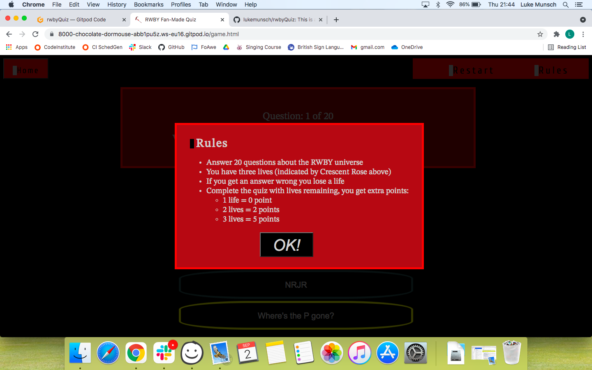

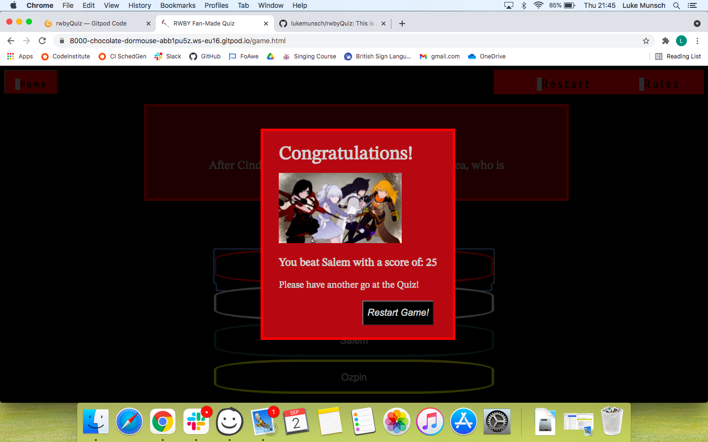

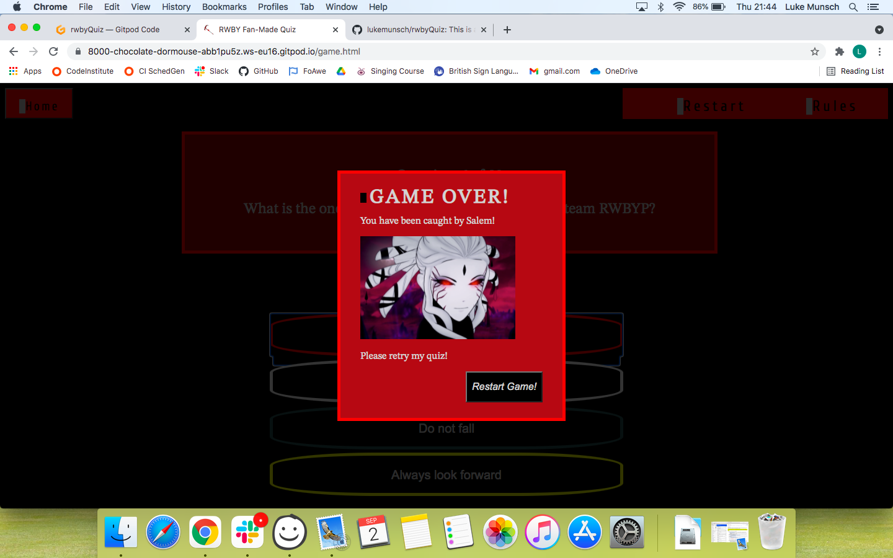

## Implementation

The main page is the entry to the entire site; 
- Simple image to show the iconic image fomr the subject show.
- Simple button top right to explain what the page is about.
- Iconic logo of main protagonist as entry to the main quiz page with explanation text.
- Minimalistic footer with simple text so as not to ditract from main topic buttons and features.

The game page is consisting of most of the elements and functions as well as modals and styles;
- Direction back to the main home page in top left.
- Restarting the quiz and a rules pop up that appears and disappears when relevant buttons are clicked.
- Question Area with simple contracting colors and auto populating using JavaScript.
- Answer buttons that bring up corresponding answers depending on the question that is asked.

The images for the pages were found and located on google searches (pages credited at bottom of README.md
file), and though the files were not large, I have compressed the images and logos to better load quicker
and improve the performance of the site.

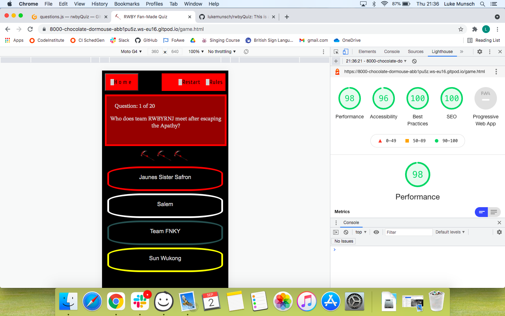

## Testing

The quiz has been put through validator checks to confirm that there are no issues with the code.
I have also been using the dev Tools in Chrome browser to inspect certain code to make sure they 
are operating correctly and elements displaying properly. The code has been passed through validators 
for the HTML and CSS - the green line at the bottom of the images showing that the code contains no errors.
I have provided screenshots below to confirm the results of the validator checks.

Along with validators, I have passed the quiz through multiple different devices and linked it to 
social media for other people to try and test the site; making sure answers are correct as well as the 
functions are called correctly at appropriate times. On different devices and by different users no issues were reported.

### HTML

#### Index Page Check

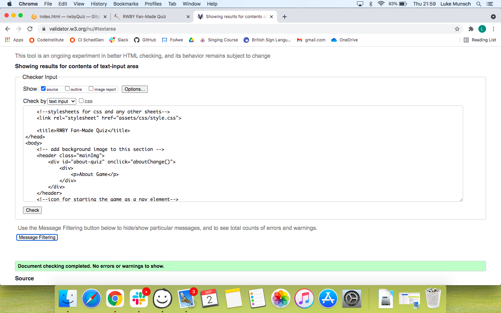

#### Game page Check

### CSS

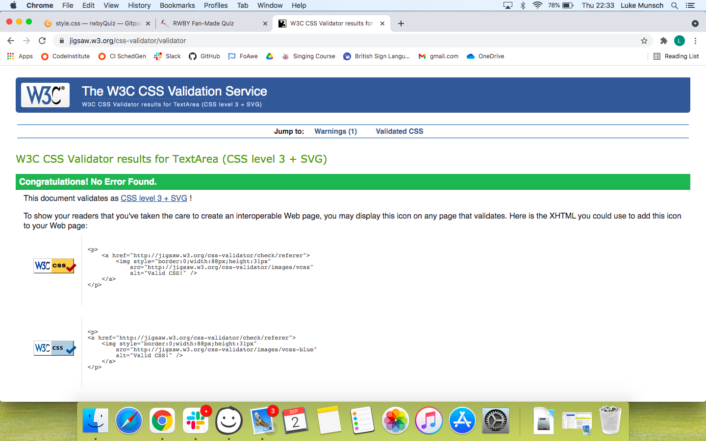

### JS 

#### Questions Check

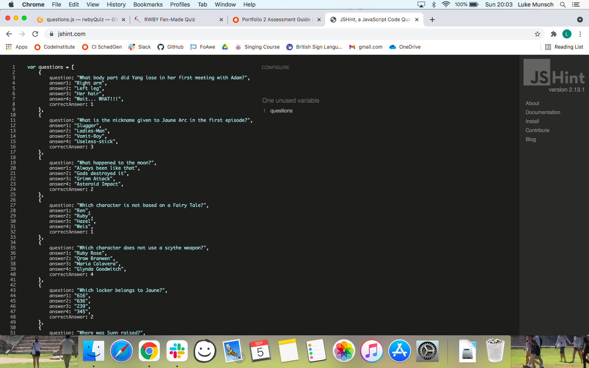

#### Script Check

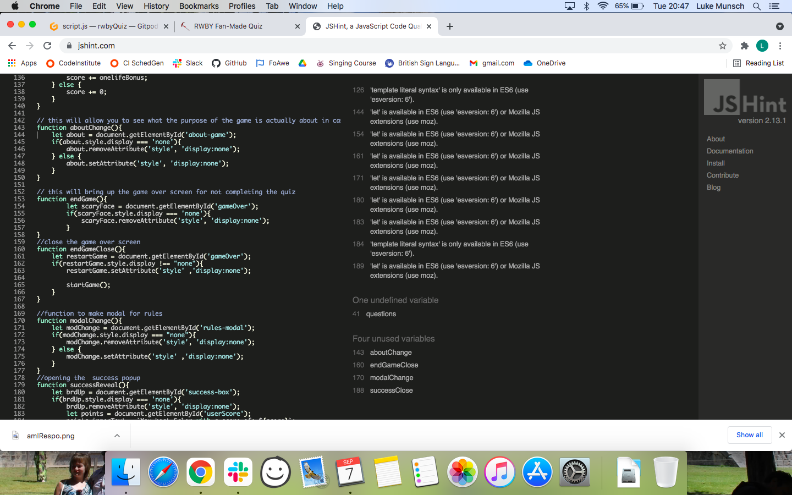

## Unfixed Bugs

Originally I had a separate leaderboard modal with a submit button for usernames and their relevant 
scores. Though I managed to style the modal, and then decided on a separate page to display the results. 
But I was unable to fix the bug where the correct score would be pushed to the scorer array. So rather than 
have a broken page with no results displaying correctly, I have removed the section and continued to 
look into this in case I decide to include it at a later date.

I have an issue regarding the buttons themselves; the internal content is only the space of the word, and 
yet when the rest of the button is clicked, no action happens. I have tried to increase the size of the 
field and width of the element itself, but it doesn't change the clickable area for the buttons. I have 
looked at trying to change the target for the clickable function to see if that makes a difference.

## Deployment

### Local Deployment

#### Forking Repositories

To propose fixing changes to some code, or to use the code as a starting point for your 
own project, you can fork the repository by clicking the 'Fork' button in the top right hand 
corner of the Github repository page.

#### Cloning Repositories

To clone a repository to use in your own project you can:
- Click on the 'Code' button next to the gitpod link which will bring down a dropdown menu, from there either:
    - Clone the repository by copying the link for the repo and using it for your own project,
    - Downloading the zip of the file to use for your own project.

### Remote Deployment

Whether you have cloned, forked, downloaded an existing repository or created your own repository,
you can deploy your code to the web from your repository page. To complete this, you can:
1. Navigate to settings (upper right of the page).
2. On the left, navigate downwards to the Pages section.
3. When the page loads there would be a dropdown in main section of page, choose main/master.
4. Hit Save and wait for link to show as: "Your site is published at 
https://<'your-github-repo'>.github.io/rwbyQuiz/"

## Credits

In the beginning of the JavaScript section of my project, I created numerous versions of my 
code but I couldn't make the code complete what I wanted it to. Through my research, I have 
managed to find an example of a quiz site that I based the structure on to help build my 
site. I borrowed some code that he also used for his quiz as I struggled to link the 
answers to the corresponding buttons, but it has been adapted and changed for my own project:

    answers.forEach( answer => {
            const number = answer.dataset.answer;
            answer.innerText = currentQuestion['answer' + number];
        });

    answers.forEach(answer => {
    answer.addEventListener('click', e => {

            if(!answerRequired) return;

            answerRequired = false;
            const selectedOption = e.target;

I have built on and adapted the code to fix the issues with my own quiz. The main 
video I used was James Q Quick's video on youtube, https://www.youtube.com/watch?v=zZdQGs62cR8
is the video for fixing the issues I had with my quiz code.

I did have a few issues with a pop-up modal that failed to appear and disappear with the clicking
of certain elements but another user called Dean Andrejevic was able to assist me. Together we were 
able to resolve the issue and made the modals appear as necessary.

I was also having trouble with my lifeline icons not disappearing - and then once they did, not
reappearing when the quiz restarted - and together with my mentor, Chris Quinn, I was able to adapt
my code and identify the issues with targeting my specific elements and then making sure the 
elements were styled correctly in the start game function. The code i finally managed to come up with was:

    let loseLife = document.body.querySelector(`.lifeline[data-life="${lifeLost}"]`);
    loseLife.setAttribute('style', 'display:none');

}

The images I have used for my site were found through google searches for specific logos/icons/images:
- The larger main logo is from https://geekdad.com/wp-content/uploads/2015/10/RWBYLogo.png,
- The smaller main logo is from https://i.kym-cdn.com/photos/images/original/000/628/214/9ed.png,
- The rose emblem is from https://static.wikia.nocookie.net/rwby/images/3/34/Ruby_Rose_Emblem.svg/revision/latest/scale-to-width-down/250?cb=20150103071935
- The scythe icon for lifelines is from https://e7.pngegg.com/pngimages/790/597/png-clipart-scythe-rwby-volume-4-chapter-1-the-next-step-rooster-teeth-cosplay-anime-ruby-others-miscellaneous-weapon.png
- The Salem game over image is from https://ladygeekgirl.files.wordpress.com/2016/06/rwby-salem.png
- The successful game image is from https://static.wikia.nocookie.net/rwby/images/2/2c/Team_RWBY_charges.jpeg/revision/latest?cb=20171029001801